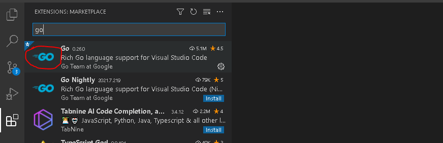
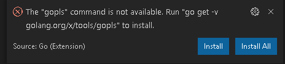
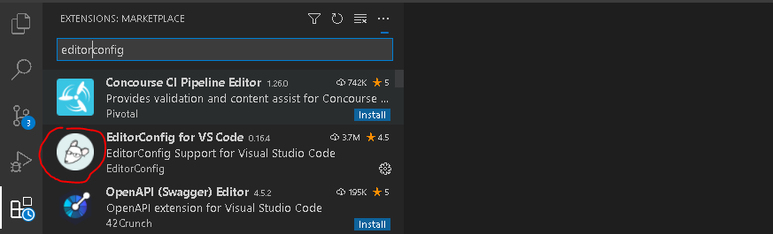

## GO环境安装

去[GO官网](https://golang.google.cn/)下载安装文件并安装。例如，把GO安装到目录E:\GO\GOROOT，这个目录对应GO环境变量GOROOT，也就是GO的安装目录。

另一个GO环境变量GOPATH也比较重要，它表示GO项目的工作目录，例如，创建目录E:\GO\GOPATH作为GOPATH。

同时，GOROOT和GOPATH这两个环境变量是要设置到系统环境变量里的。

## Git安装与配置

下面安装的Git和TortoiseGit主要用于管理基于Git版本管理的项目。

### 安装Git

去[Git官网](https://git-scm.com/)下载安装文件并安装。

### 安装TortoiseGit

去[TortoisGit官网](https://tortoisegit.org/)下载安装文件并安装。

## VSCode安装与配置

### 安装VSCode

去[Visual Studio Code官网](https://code.visualstudio.com/)下载安装文件并安装。VSCode具体使用可以参考[官方使用文档](https://code.visualstudio.com/docs)。

### 安装VSCode插件

VSCode插件是通过Extensions Marketplace下载安装的。打开VSCode后，通过右侧栏可以找到Extensions（或通过按Ctrl+Shift+X组合键找到），在Extension Marketplace中搜索框中搜索需要安装的插件即可。

#### 安装go插件

在Extensions Marketplace搜索框中输入go，找到go插件并安装。



在Terminal中执行以下命令配置go环境变量，其中GO111MODULE是使用模块管理go项目，GOPROXY是配置国内代理加速下载：

```
go env -w GO111MODULE=auto
go env -w GOPROXY=https://goproxy.cn,direct
```

重新打开VSCode，根据右下方弹出的安装依赖提示，点击“Install All”会自动安装。



如果有未安装成功的，可以在Terminal中执行命令安装。以下是安装过程输出的信息。

```
Tools environment: GOPATH=E:\GO\GOPATH
Installing 10 tools at E:\GO\GOPATH\bin in module mode.
  gopkgs
  go-outline
  gotests
  gomodifytags
  impl
  goplay
  dlv
  dlv-dap
  staticcheck
  gopls

Installing github.com/uudashr/gopkgs/v2/cmd/gopkgs (E:\GO\GOPATH\bin\gopkgs.exe) SUCCEEDED
Installing github.com/ramya-rao-a/go-outline (E:\GO\GOPATH\bin\go-outline.exe) SUCCEEDED
Installing github.com/cweill/gotests/gotests (E:\GO\GOPATH\bin\gotests.exe) SUCCEEDED
Installing github.com/fatih/gomodifytags (E:\GO\GOPATH\bin\gomodifytags.exe) SUCCEEDED
Installing github.com/josharian/impl (E:\GO\GOPATH\bin\impl.exe) SUCCEEDED
Installing github.com/haya14busa/goplay/cmd/goplay (E:\GO\GOPATH\bin\goplay.exe) SUCCEEDED
Installing github.com/go-delve/delve/cmd/dlv (E:\GO\GOPATH\bin\dlv.exe) SUCCEEDED
Installing github.com/go-delve/delve/cmd/dlv@master (E:\GO\GOPATH\bin\dlv-dap.exe) SUCCEEDED
Installing honnef.co/go/tools/cmd/staticcheck (E:\GO\GOPATH\bin\staticcheck.exe) SUCCEEDED
Installing golang.org/x/tools/gopls (E:\GO\GOPATH\bin\gopls.exe) SUCCEEDED

All tools successfully installed. You are ready to Go :)
```


#### 安装editorconfig插件

在Extensions Marketplace搜索框中输入editorconfig，找到editorconfig插件并安装。



配置editorconfig，在项目根目录下添加.editorconfig文件，写入以下配置：

```ini
root = true

[*]
charset = utf-8
indent_style = space
indent_size = 2
end_of_line = lf
insert_final_newline = true
trim_trailing_whitespace = true
```


### 支持GO项目中包含多个模块配置

打开settings.json，点击左下角齿轮图标，

```
Settings -> Text Editor -> Code Actions On Save -> Edit in settings.json
```

在settings.json设置里面添加如下配置：

```json
"gopls": {
        "experimentalWorkspaceModule": true
    }
```


## 参考资料

[VSCode配置Go插件和第三方拓展包](https://www.cnblogs.com/WindSun/p/12195944.html)

[VScode show me the error after I install the proxy in vscode](https://stackoverflow.com/questions/65748509/vscode-show-me-the-error-after-i-install-the-proxy-in-vscode)

[vscode如何打开settings.json](https://blog.csdn.net/qq_25378657/article/details/109516161)
